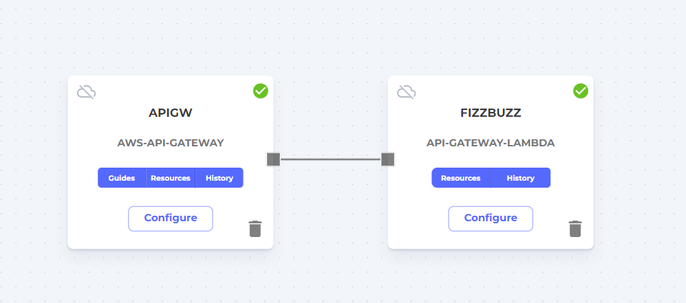

# AWS API Gateway Driven Lambda

This is an example of a Lambda function triggered by an API Gateway integration.

## Running this example

```bash
cd function
mass image push <namespace>/<image> -r <aws-region> -a <artifact-id> -t <tag>
```

Copy the image name and tag in the success message of that command.

```bash
cd ..
mass app publish
```

## Configure the Infrastructure



Drag on to the Massdriver canvas an API Gateway and configure it. Once it has rolled out you can test it with

```bash
curl -v https://yourdomain.hostedzone.com/_health
```

Drag on to the canvas your published application and connect it to the REST API. Once it has rolled out it can be
tested by running:

```bash
curl -X POST https://yourdomain.hostedzone.com/yourpath -d '{"query": 5}'
```
