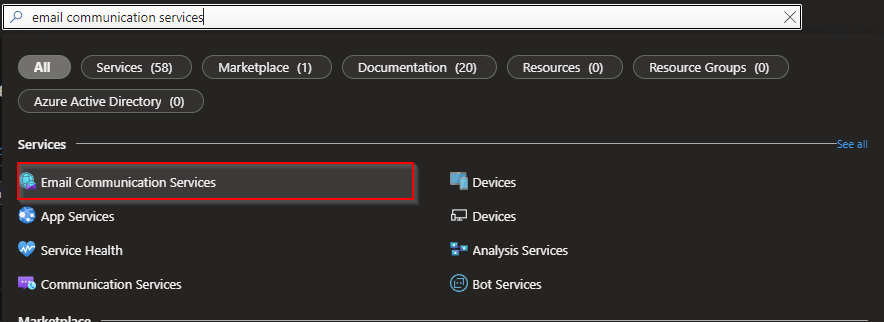
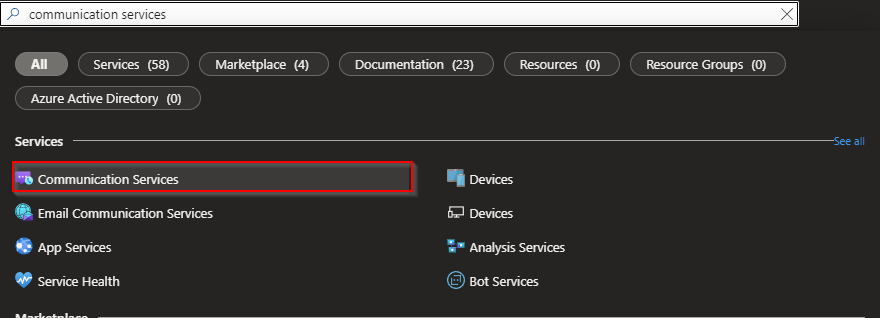
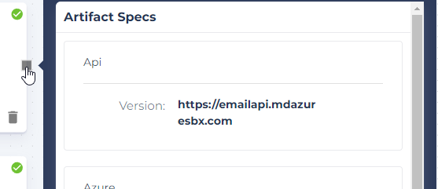

# communication-service

This example provisions a Function App that can connect to an Azure Communication Service bundle. This example is using the [Azure Email Communication Services](https://learn.microsoft.com/en-us/azure/communication-services/concepts/email/email-overview) resource, which is still in public preview.

Once the Email service is generally available, we will build the bundle to deploy this from within Massdriver.

## Use case
This application example will let you send an email to any recipient(s) using API requests.

## Deployment guide
Below are the steps needed to deploy this example in Massdriver:
1. Clone the repo
2. `cd` into `application-examples/azure/function-app/communication-service` and run `mass app publish`. If you don't have your Massdriver API key or CLI, follow these [steps](https://docs.massdriver.cloud/bundles/walk-through#generate-massdriver-api-token)
3. Drag an `azure-virtual-network`, `azure-communication-service`, and the example app into your canvas
4. Deploy `azure-virtual-network` and `azure-communication-service` bundles
5. Connect the example app to both the `azure-virtual-network` and `azure-communication-service` bundles
6. Add the `email-api-example-app:latest` docker [image](https://hub.docker.com/r/massdrivercloud/email-api-example-app) to the example app
7. Deploy the app
8. Provision an Email service resource in the Azure portal by searching for Email Communication Services

9. Click on the **Provision domains** blade and **Add domain** -> **Azure domain**
10. Once deployed, click on the **Domain name** and copy the **MailFrom** address. Save this for a later step
11. Search and open your Communication service in the Azure portal by searching for Communication Services

12. Click on the **Domains** blade under **Email** and click **Connect domain**
13. Select the resource group from where you deployed your Email service
14. Select the email service you provisioned
15. Select the verified domain you provisioned and click **Connect**
16. On the Massdriver canvas, copy the endpoint from the example app artifact output

17. Send a POST request to the app endpoint using this in body (raw JSON):
```JSON
{
  "subject": "Test subject",
  "senderEmail": "jimmy@massdriver.cloud",
  "recipients": [{
    "email": "jimbo@massdriver.cloud",
    "displayName": "Jimbo"
  }],
  "emailPlainText": "Hey Jimbo,
  This is a test email from Massdriver.
  Thanks,
  Jimmy",
}
```
And this in header:
```
Content-Type: application/json
```