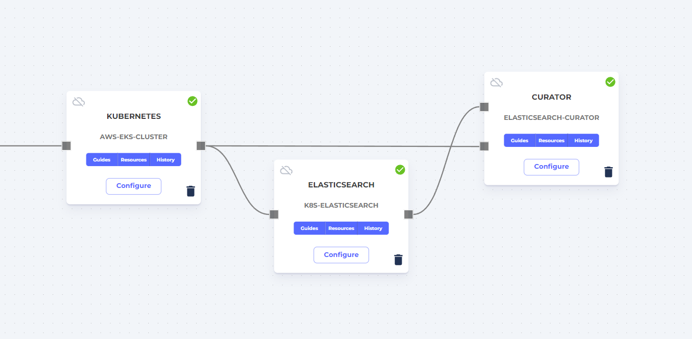

# elasticsearch-curator-cronjob

This demonstrates how to use the kubernetes-cronjob application template to run the [Elasticsearch Curator](https://github.com/elastic/curator) as a cronjob in a Kubernetes cluster. This example uses Bitnami's public Docker image found [here](https://hub.docker.com/r/bitnami/elasticsearch-curator).

## Massdriver `kubernetes-cronjob` Template

The `kubernetes-deployment` template will run your application on AWS, GCP, or Azure Kubernetes.

**Customization**:

* In [`massdriver.yaml`](./massdriver.yaml) additional parameters were added to the end of the `params` block to specify the curator age and log level. Additionally, an `elasticsearch` connection was added to require an elasticsearch cluster to be connected for the curator to run against.
* In [`massdriver.yaml`](./massdriver.yaml) the `image.repository`, `command` and `args` parameters were removed. This was done to simplify usage in the Massdriver UI. Instead these values are now specified in the helm chart default [`values.yaml`](./src/chart/values.yaml).
* The helm chart default [`values.yaml`](./src/chart/values.yaml) was updated to have "hardcoded" values for `image.repository`, `command` and `args`. This was done in unison with the previous bullet.
* The [`main.tf`](./src/main.tf) file was updated to pass the elasticsearch artifact information in the `helm_additional_values` module variable. This is required to properly configure the curator.
* A [`configmap.yaml`](./src/chart/templates/configmap.yaml) file was added to the helm chart template files in order to get the `action_file.yml` and `config.yml` file into the cronjob. Additionally, the [`cronjob.yaml`](./src/chart/templates/cronjob.yaml) file was updated to volume mount the configmap to the cronjob.
* An [`action_file.yml.tpl`](./src/chart/files/action_file.yml.tpl) and [`config.yml.tpl`](./src/chart/files/config.yml.tpl) were added as template files to specify the configuration of the curator.
