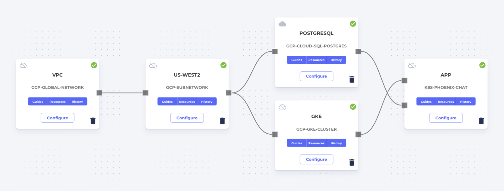

# phoenix-chat

A Phoenix / Elixir application demo running [dwyl/phoenix-chat-example](https://github.com/massdriver-cloud/phoenix-chat-example). The public Docker image can be found [here](https://hub.docker.com/repository/docker/massdrivercloud/express-mongo-guestbook).

## Massdriver `kubernetes-deployment` Template

The `kubernetes-deployment` template will run your application on AWS, GCP, or Azure Kubernetes.

**Files**:

* a [terraform module](./src) is included that configurings IAM permissions and sets up you environment variables. You likely _do not_ need to modify these files. This module is simply rigging code to integrate with Massdriver Cloud.
* a [helm chart](./src/chart) has been created to run a kubernetes deployment. This Helm chart is a great getting started point for deploying to Kubernetes. Feel free to modify the chart to customize your application deployment.
* the [`massdriver.yaml`](./massdriver.yaml) controls the UI to expose for configuring your application and its dependencies. By default there are a lof of fields in your [`params`](https://docs.massdriver.cloud/bundles/configuration#bundle-params) section, feel free to remove fields that you do not want exposed in your configuration form in Massdriver Cloud. Values that you do not want to change (e.g.: your image repository) can be hard coded in the [values.yaml](./src/chart/values.yaml) file.
